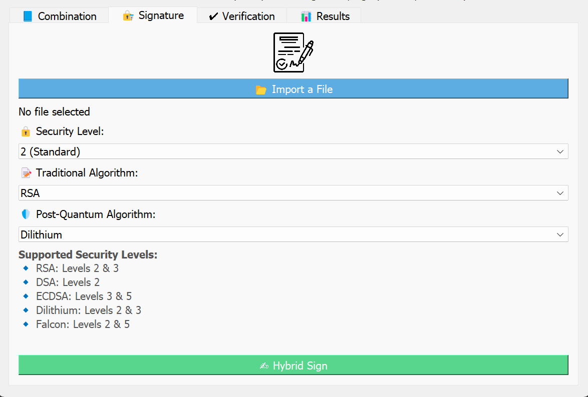

## Hybrid Signature for Post-Quantum Era

This repository implements the hybrid signature system, which combines classical and quantum encryption.

- Classical ciphers available : RSA, DSA, ECDSA

- Quantum ciphers available : Dilithium, Falcon

## Introduction

## Motivation of your work

## Implementation description

The project is composed of two main components: a backend in C for cryptographic operations and a graphical interface in Python using PyQt5

#### Project structure :

1. [`rsa_sign.c`](Signature/rsa_sign.c) allows to implement the RSA's signature
2. [`rsa_sign.h`](Signature/rsa_sign.h) allow to call the function that implements RSA's signature
3. [`ecdsa_sign.c`](Signature/ecdsa_sign.c) allows to implement the ECDSA's signature
4. [`ecdsa_sign.h`](Signature/ecdsa_sign.h) allow to call the function that implements ECDSA's signature
5. [`dsa_signature.c`](Signature/dsa_signature.c) allows to implement the DSA's signature
6. [`dsa_signature.h`](Signature/dsa_signature.h) allow to call the function that implements DSA's signature
7. [`dilithium_signature.c`](Signature/dilithium_signature.c) allows to implement the dilithium's signature
8. [`dilithium_signature.h`](Signature/dilithium_signature.h) allow to call the function that implements dilithium's signature
9. [`falcon_signature.c`](Signature/falcon_signature.c) allows to implement the falcon's signature
10. [`falcon_signature.h`](Signature/falcon_signature.h) allow to call the function that implements falcon's signature
11. [`hybrid_signature.c`](Signature/hybrid_signature.c) allows to call twice function that implement signature and implement the hybrid signature
12. [`interface`](interface/signature_gui.py) allows to call twice function that implement signature and implement the hybrid signature

### Functions developed:

- Import a file to be signed.
- Selection of two signature algorithms (traditional + post-quantum).
- Hybrid signature with results recording (execution time).
- Signature verification.
- Visualization of results in table (setup, sign, verify).

## How to install your GUI
### Prerequisites :
- Python 3.9 or higher
- A C compiler (e.g., gcc)
- pip install pyqt5
- pip install matplotlib
- git clone https://github.com/Farmata94/Sign-Hybrid.git
- cd Signature
### Installing dependencies
Clone the necessary libraries in the Signature folder:
- git clone https://github.com/PQClean/PQClean.git
- git clone https://github.com/open-quantum-safe/liboqs.git
- git clone https://github.com/pq-crystals/dilithium.git
You also need the openSSl library

### Configuration liboqs
Still in the Signature folder
1. cd liboqs
2. mkdir build 
3. cd build
4. cmake -DOQS_ENABLE_SIG=ON -DOQS_DIST_BUILD=OFF -DCMAKE_INSTALL_PREFIX=../install ..
5. cmake --build .     
6. cmake --install .
7. cd ..\..\..\

### Execution
Run the compilation command :
gcc -Wall -Wextra -O2  -I Signature/dilithium/ref  -I Signature/liboqs/build/include  Signature/hybrid_signature.c  Signature/dsa_signature.c  Signature/rsa_sign.c  Signature/ecdsa_sign.c  Signature/dilithium_signature.c Signature/falcon_signature.c  Signature/timing.c  Signature/dilithium/ref/*.c  -L Signature/liboqs/build/lib -loqs -lcrypto -lssl  -o hybrid_signature

### Launching the application :
From the GUI folder, launch the interface signature_gui.py.

## How to use

## Authors

CISSE Farmata

MBONGO Noémie

TAYO FOYO Cabrel
 
Supervised by RICCI Sara