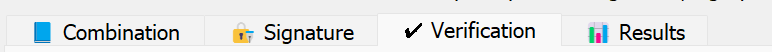
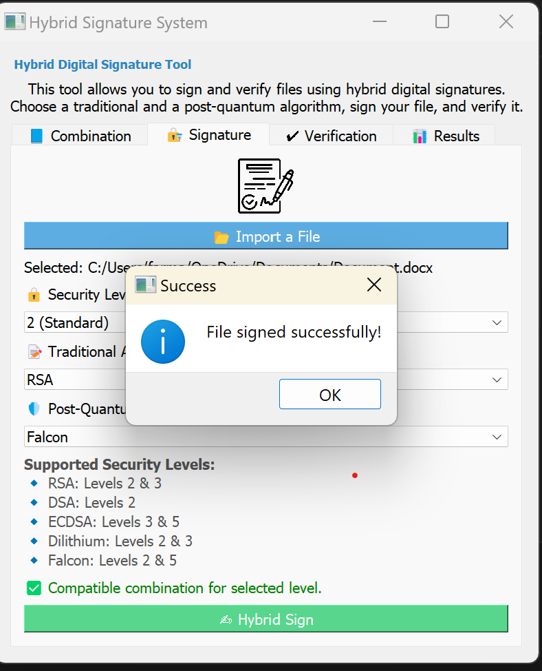
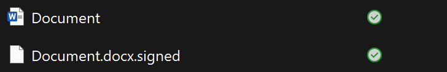
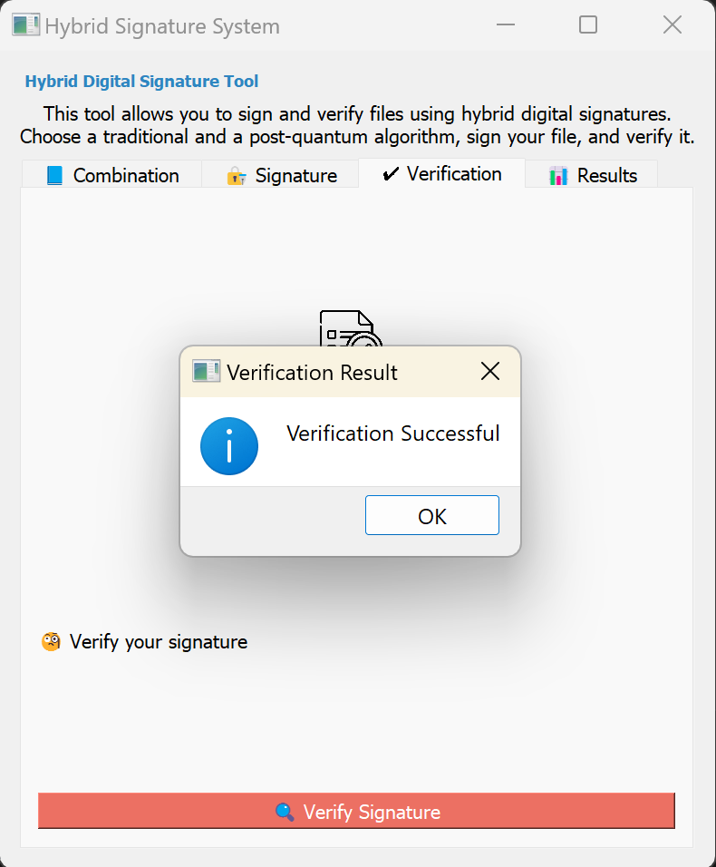
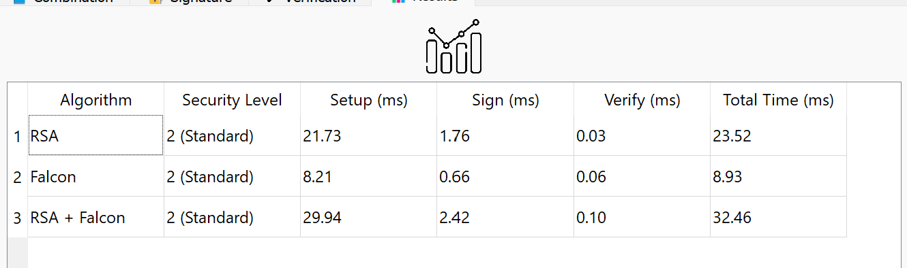

## Hybrid Signature for Post-Quantum Era

This repository implements the hybrid signature system, which combines classical and quantum encryption.

- Classical ciphers available : RSA, DSA, ECDSA

- Quantum ciphers available : Dilithium, Falcon

## Introduction

With the advent of quantum computing, traditional cryptographic systems such as RSA, DSA, and ECDSA are becoming increasingly vulnerable 
to quantum attacks — particularly those based on Shor’s algorithm. This project introduces a **hybrid digital signature solution** that combines:

- A **classical algorithm** (RSA, DSA, or ECDSA)  
- A **post-quantum algorithm** (Dilithium, Falcon)

🎯 **Objectives**  
- Ensure a **secure transition** from classical to post-quantum cryptography  
- Maintain **compatibility** with current infrastructures and systems  
- Reinforce **resilience** against both present and future cryptographic threats

💡 **Key Features**  
- Hybrid signing and verification of files  
- Graphical interface with **algorithm selection** (via PyQt5)  
- Adjustable **security levels**: Standard, High, Maximum  
- Built-in **execution time measurement** for benchmarking (keygen, sign, verify)

## Motivation of your work

With the advent of quantum computers, classical cryptographic security systems, such as RSA, DSA and ECDSA, risk becoming vulnerable to quantum attacks. Shor's algorithm solves factorization and discrete logarithm problems, on which the security of these signatures is based.

It is therefore crucial to prepare for the future by integrating cryptographic solutions that are resilient to quantum threats. This work aims to develop a hybrid solution combining classical and post-quantum algorithms, to ensure optimum security against both classical and quantum attacks. This will guarantee the security of digital signatures, even with the rise of quantum computers, while maintaining compatibility with current technologies.

The aim is to create a solution capable of withstanding present and future threats, anticipating the impact of the post-quantum era on cryptography.

## Implementation description

The project is composed of two main components: a backend in C for cryptographic operations and a graphical interface in Python using PyQt5

### Project structure :

1. [`rsa_sign.c`](Signature/rsa_sign.c) allows to implement the RSA's signature
2. [`rsa_sign.h`](Signature/rsa_sign.h) allow to call the function that implements RSA's signature
3. [`ecdsa_sign.c`](Signature/ecdsa_sign.c) allows to implement the ECDSA's signature
4. [`ecdsa_sign.h`](Signature/ecdsa_sign.h) allow to call the function that implements ECDSA's signature
5. [`dsa_signature.c`](Signature/dsa_signature.c) allows to implement the DSA's signature
6. [`dsa_signature.h`](Signature/dsa_signature.h) allow to call the function that implements DSA's signature
7. [`dilithium_signature.c`](Signature/dilithium_signature.c) allows to implement the dilithium's signature
8. [`dilithium_signature.h`](Signature/dilithium_signature.h) allow to call the function that implements dilithium's signature
9. [`falcon_signature.c`](Signature/falcon_signature.c) allows to implement the falcon's signature
10. [`falcon_signature.h`](Signature/falcon_signature.h) allow to call the function that implements falcon's signature
11. [`hybrid_signature.c`](Signature/hybrid_signature.c) allows to call twice function that implement signature and implement the hybrid signature
12. [`interface`](interface/signature_gui.py) allows to call twice function that implement signature and implement the hybrid signature

### Functions developed :

- Import a file to be signed.
- Selection of two signature algorithms (traditional + post-quantum).
- Hybrid signature with results recording (execution time).
- Signature verification.
- Visualization of results in table (setup, sign, verify).

## How to install your GUI
### Prerequisites :
- Python 3.9 or higher
- A C compiler (e.g., gcc)
- pip install pyqt5
- pip install matplotlib
- git clone https://github.com/Farmata94/Sign-Hybrid.git
- cd Signature
### Installing dependencies
Clone the necessary libraries in the Signature folder:
- git clone https://github.com/PQClean/PQClean.git
- git clone https://github.com/open-quantum-safe/liboqs.git
- git clone https://github.com/pq-crystals/dilithium.git

You also need the openSSl library

### Configuration liboqs
Still in the Signature folder
1. cd liboqs
2. mkdir build 
3. cd build
4. cmake -DOQS_ENABLE_SIG=ON -DOQS_DIST_BUILD=OFF -DCMAKE_INSTALL_PREFIX=../install ..
5. cmake --build .     
6. cmake --install .
7. cd ..\\..\\..\\

### Execution
Run the compilation command :

- gcc -Wall -Wextra -O2  -I Signature/dilithium/ref  -I Signature/liboqs/build/include  Signature/hybrid_signature.c  Signature/dsa_signature.c  Signature/rsa_sign.c  Signature/ecdsa_sign.c  Signature/dilithium_signature.c Signature/falcon_signature.c  Signature/timing.c  Signature/dilithium/ref/*.c  -L Signature/liboqs/build/lib -loqs -lcrypto -lssl  -o hybrid_signature

### Launching the application :
From the GUI folder, launch the interface signature_gui.py.

## How to use

First you need to import the file that you want signed. Then, choose the security level and finally the signatures in order to proceed with the hybrid signature

In the verification section you can check if the file has been signed correctly and in the result section the execution time for each step of the signature.

## Statistics results

Example of the results achieved with our system include:

We have a file that is signed :

The processing time for each step of the hybrid signature :

## Conlcusion

This project is part of a proactive approach to secure digital communications in the post-quantum era. By combining a classic signature and a signature resistant to quantum attacks, we have put in place a hybrid solution that combines compatibility with current systems and robustness against future threats.

The C implementation of different signature algorithms, coupled with an intuitive graphical interface in Python, allows not only to test different combinations of signatures, but also to measure their performance in terms of execution time.

The results obtained show that the hybrid system is able to ensure the integrity and authenticity of files while remaining accessible to the user through a clear interface. This solution provides a solid foundation for future research or integrations into more complex systems as quantum technologies become reality.

## Authors

CISSE Farmata

MBONGO Noémie

TAYO FOYO Cabrel
 
Supervised by RICCI Sara

#### WORK DISTRIBUTION

- Farmata : implementation of verification and hybrid signatures, site GUI, back-end (connecting results)
- Noémie : implementation of classical and quantum signatures, site GUI
- Cabrel : implementation of classical and quantum signatures, site GUI

